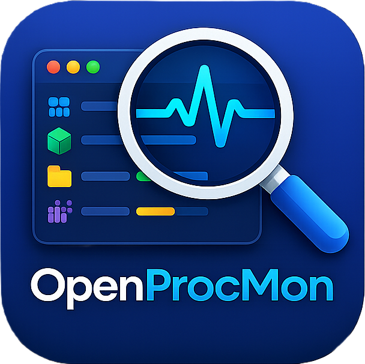
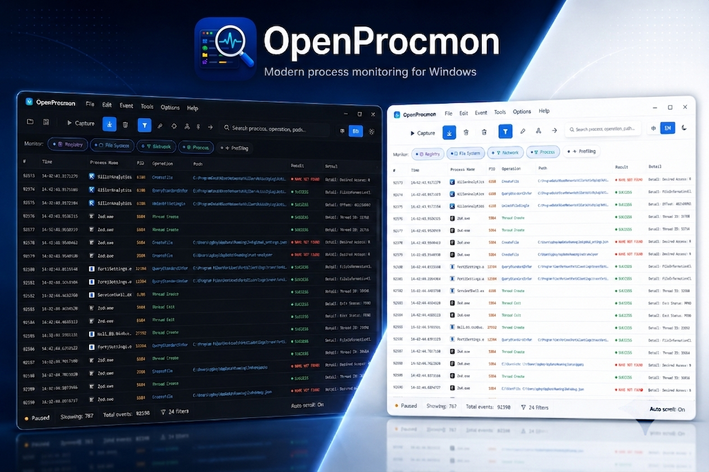
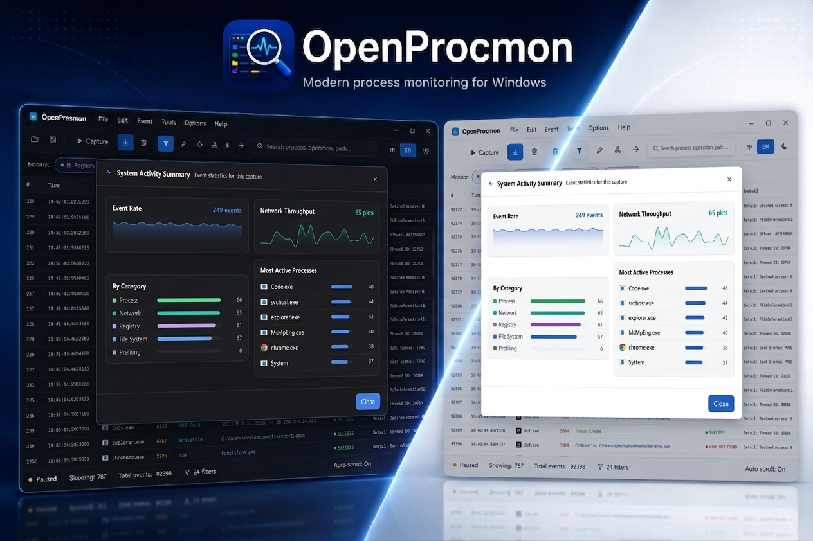
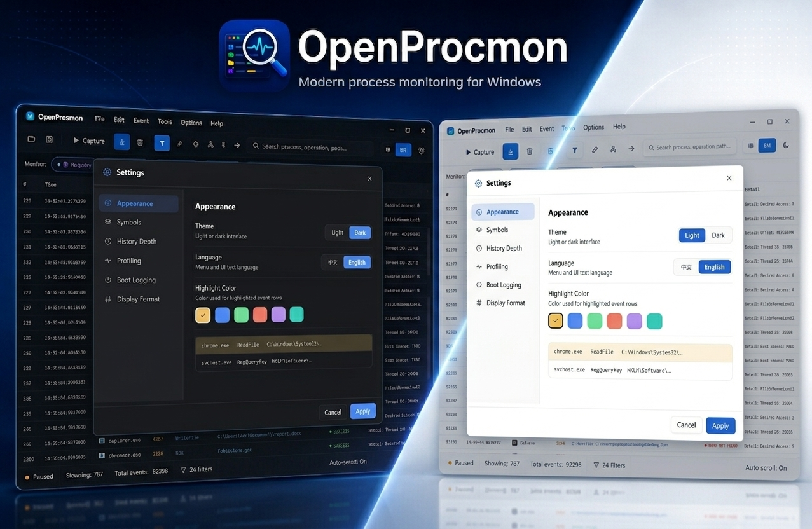

<div align="center">
  
  <p><strong>English</strong> · <a href="docs/readme_zh.md">中文</a></p>
</div>

# OpenProcMon

An open-source [Process Monitor](https://learn.microsoft.com/en-us/sysinternals/downloads/procmon) implementation for Windows: a kernel miniFilter driver captures process, file, registry and network activity in real time, a Rust SDK talks to the driver and parses the event stream, and a Rust/GPUI desktop GUI presents it.

> **This is a ground-up Rust rewrite** of the SDK and GUI. The kernel driver is unchanged, and the original C++ implementation is kept under [`cpp-backup/`](cpp-backup/) for reference. The Rust SDK is wire-compatible with the original Process Monitor driver and can read/write Procmon `.PML` logs.



## Contents

- [Architecture](#architecture)
- [Repository layout](#repository-layout)
- [Features](#features)
- [Screenshots](#screenshots)
- [Build](#build)
- [Run](#run)
- [SDK example](#sdk-example)
- [PML logs](#pml-logs)
- [Driver compatibility](#driver-compatibility)
- [Known issues](#known-issues)
- [Status & roadmap](#status--roadmap)
- [License](#license)

## Architecture

```
┌──────────────────────────────────────────────┐
│  GUI            crates/gui  (Rust + GPUI)    │  event table · detail panel ·
│                                              │  filter/highlight · process tree
├──────────────────────────────────────────────┤
│  SDK            crates/sdk  (Rust)           │  driver port · event parsing ·
│                                              │  process tracking · PML read/write
├──────────────────────────────────────────────┤
│  Kernel driver  kernel/     (C, miniFilter)  │  process/file/registry callbacks
└──────────────────────────────────────────────┘
```

The driver and the SDK communicate over a Filter Manager communication port; the
kernel/user-mode contract lives in [`kernel/logsdk.h`](kernel/logsdk.h), which the
Rust SDK mirrors with `#[repr(C, packed)]` structures.

## Repository layout

```text
openprocmon/
├── bin/          # Prebuilt binaries (e.g. the stock Process Monitor driver, PROCMON24.SYS)
├── cpp-backup/   # Original C++ SDK + WTL GUI, kept for reference
├── crates/       # Rust workspace
│   ├── sdk/      #   procmon-sdk — driver comms, event parsing, PML read/write, symbols
│   ├── gui/      #   procmon-gui — GPUI desktop app (live capture + .PML viewing)
│   └── example/  #   procmon-example — console SDK demo (capture / save / replay)
├── docs/         # Design docs, logo, and screenshots
└── kernel/       # miniFilter driver (C, built with the WDK)
```

## Features

- Real-time monitoring of **process, file system, registry, and network** activity.
- Live **filtering** and **highlighting** by process name, PID, operation, path, result, or category.
- **Process tree**, and **activity summaries** for processes, files, registry, network, and cross-references.
- **Call stack** view with per-frame module resolution.
- Read and write **Procmon-compatible `.PML`** logs — capture with OpenProcMon and open in Sysinternals Process Monitor, or vice versa.
- **Full-control Rust SDK** — drive everything programmatically: load/connect the driver, choose what to monitor, push filters, and consume the parsed event stream. The GUI is just one consumer (see [SDK example](#sdk-example)).
- **Modern, GPU-accelerated UI** (GPUI) with a clean, contemporary design — light/dark themes and English/Chinese localization.

## Screenshots

**Process activity summary** — per-process event counts with a category breakdown.



**Settings** — symbol/dbghelp paths, history limits, highlight color, theme and language.



## Build

### Prerequisites

- A recent **Rust** toolchain (stable) — see [rustup](https://rustup.rs/).
- **Windows** (the SDK and GUI use Win32 APIs).
- For the kernel driver only: the [Windows Driver Kit (WDK)](https://learn.microsoft.com/en-us/windows-hardware/drivers/download-the-wdk).

### Rust workspace

```bash
# Build everything (GUI, SDK, example)
cargo build

# Release build of the GUI
cargo build -p procmon-gui --release
```

### Kernel driver

The driver is built with the WDK (see `kernel/`). After building, either test-sign
it or enable test signing / disable driver signature enforcement before loading.

## Run

```bash
# GUI driving the real kernel driver (run elevated / as Administrator)
cargo run -p procmon-gui
```

When `procmon.sys` sits next to the executable, the GUI loads and starts the
driver on demand; capturing the real system requires Administrator privileges.

## SDK example

Live capture and offline `.PML` reading flow through one `EventSource`, so the
consume loop is identical — only how you create the source differs.

**Live capture** — connect to the driver (loading the `.sys` on demand):

```rust
use procmon_sdk::{
    Action, Column, DriverLoader, EventSource, FilterSet, MonitorFlags, Relation, Rule,
};

fn main() -> Result<(), Box<dyn std::error::Error>> {
    let source = EventSource::from_driver(
        DriverLoader::new("OpenProcmon24", "procmon.sys"),
        MonitorFlags::PROCESS | MonitorFlags::FILE | MonitorFlags::REGISTRY,
    )?;

    // An Include rule restricts the view to its matches: show only notepad.exe.
    source.set_filter(FilterSet::new(vec![Rule::new(
        Column::ProcessName,
        Relation::Is,
        "notepad.exe",
        Action::Include,
    )]));

    // `events()` streams parsed events; fields are produced lazily.
    for ev in source.events() {
        if !source.is_visible(&ev) {
            continue; // dropped by the active filter
        }
        println!(
            "{:>6}  {:<22}  {:<16}  {}",
            ev.pid(),
            ev.operation_name(),
            ev.result(),
            ev.path().unwrap_or_default(),
        );
    }
    Ok(())
}
```

**Read a `.PML`** — no driver needed; the loop is exactly the same:

```rust
use procmon_sdk::{Action, Column, EventSource, FilterSet, Relation, Rule};

fn main() -> Result<(), Box<dyn std::error::Error>> {
    let source = EventSource::from_pml("out.pml")?;

    // Exclude rules hide their matches: drop temp-file noise.
    source.set_filter(FilterSet::new(vec![Rule::new(
        Column::Path,
        Relation::EndsWith,
        ".tmp",
        Action::Exclude,
    )]));

    for ev in source.events() {
        if !source.is_visible(&ev) {
            continue;
        }
        println!(
            "{:>6}  {:<22}  {:<16}  {}",
            ev.pid(),
            ev.operation_name(),
            ev.result(),
            ev.path().unwrap_or_default(),
        );
    }
    Ok(())
}
```

Run the bundled console demo:

```bash
# Live capture (run elevated). The optional .sys path loads the driver on demand.
cargo run -p procmon-example -- [C:\path\to\procmon.sys]
```

## PML logs

OpenProcMon reads and writes the Sysinternals Process Monitor `.PML` format:

```bash
# Capture live, then save to a Procmon-compatible .PML
cargo run -p procmon-example -- --save out.pml [C:\path\to\procmon.sys]

# Replay a .PML (no driver needed)
cargo run -p procmon-example -- --pml out.pml
```

In the GUI, use **File ▸ Open** to load a `.PML`.

## Driver compatibility

You don't need your own code-signing certificate: the SDK is 100% compatible with
the original Process Monitor driver, so you can drive it with the stock Procmon
driver. Conversely, this driver can replace the original to study how Process
Monitor works, or as a starting point for your own EDR-style tooling.

## Known issues

- **32-bit (x86) is not supported.** OpenProcMon targets 64-bit Windows only — the
  driver, the SDK's packed kernel structures, and the GUI all assume an x64 host.
  Running on 32-bit Windows is not supported and not currently planned.
- **32-bit `.PML` files are not supported.** The PML reader/writer only handles the
  64-bit PML format; `.PML` logs produced on a 32-bit host will not parse.
- **`.PML` files written by OpenProcMon can crash the original Process Monitor.**
  The PML writer is not yet fully byte-compatible with the format Sysinternals
  Process Monitor expects, so logs captured/saved with OpenProcMon may cause the
  stock Procmon to crash when opened. Reading Procmon-produced `.PML` files in
  OpenProcMon, and round-tripping OpenProcMon-written `.PML` files back through
  OpenProcMon, work as expected. A fix to make the writer fully compatible is
  planned.

## Status & roadmap

The Rust rewrite is under active development.

- [x] Rust SDK: driver port, event parsing (process/file/registry/network)
- [x] Process tracking, image metadata & icon extraction
- [x] PML reader/writer (Procmon-compatible)
- [x] GUI: event table, detail panel, filter/highlight, process tree, summaries
- [x] Call stack with module resolution
- [x] Save the current capture from the GUI
- [ ] AI Mcp server and skills
- [x] Performance optimization
- [ ] Boot logging capture

## License

Released under the [MIT License](LICENSE).
